# CV-Paysys-Competition

## Overview

This project focuses on **Fingertip Detection** and **Fingerprint Extraction** using **YOLO v11**. The challenge involved processing a dataset of right and left-hand palm images, training an object detection model, identifying fingertips, cropping them, and extracting biometric fingerprints.

## Approach

### 1. Model Selection & Training

- Leveraged experience with **YOLO models** from the Final Year Project.
- Used **YOLO v11** for precise fingertip detection.
- Utilized **Roboflow** for dataset management and preprocessing.
- Trained the model on a custom dataset for 30 epochs.

### 2. Image Processing & Feature Extraction

- Applied **OpenCV** for image preprocessing and segmentation.
- Cropped detected fingertip regions for further analysis.
- Extracted high-definition **biometric fingerprint features**.

## Sample Images

### Cropped Fingertips

Here are some examples of the cropped fingertip images obtained after detection:

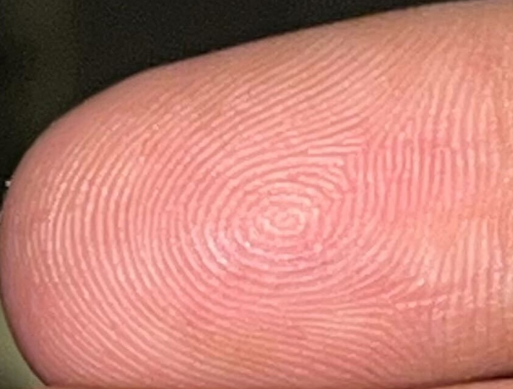
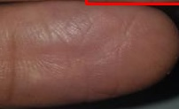
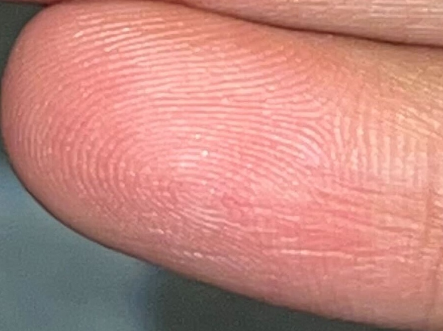
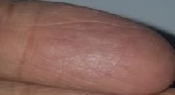
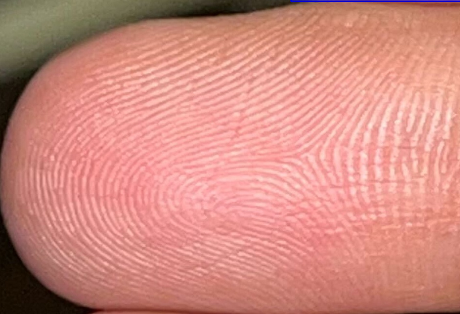
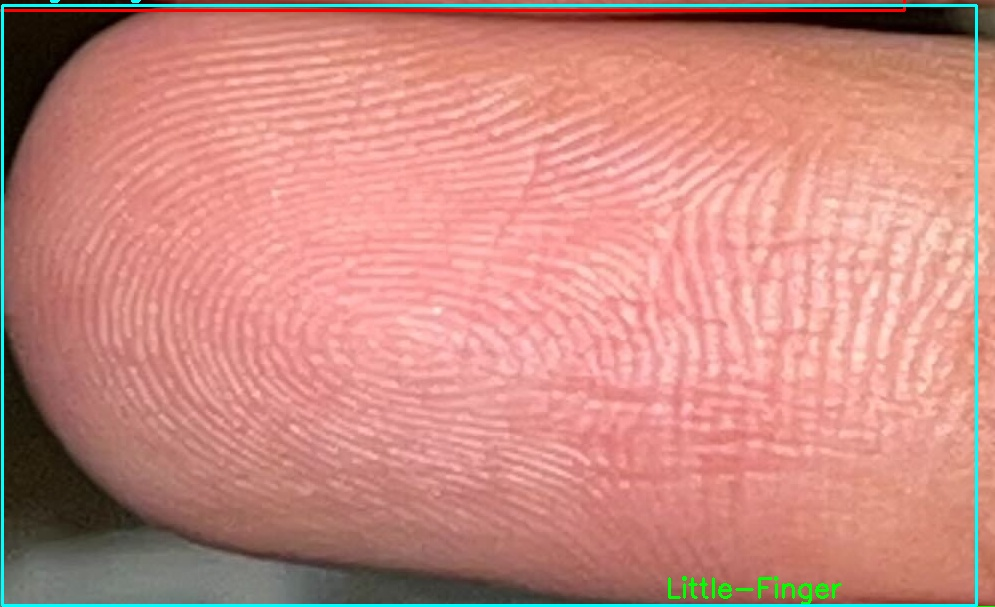
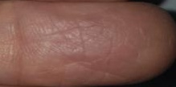
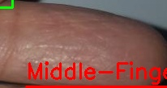
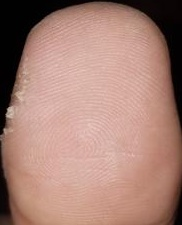

### Extracted Fingerprints

The following images showcase the extracted fingerprint features:

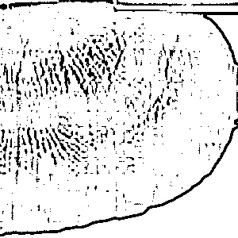
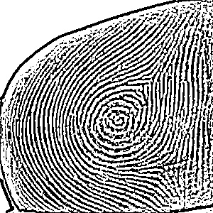
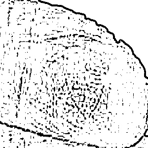
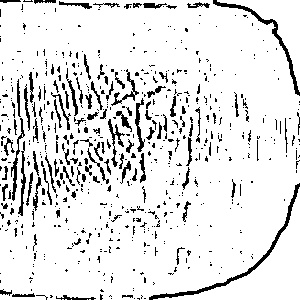
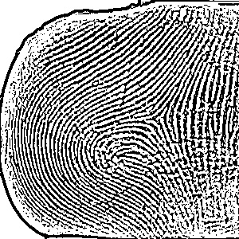
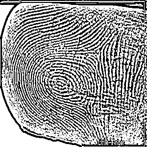
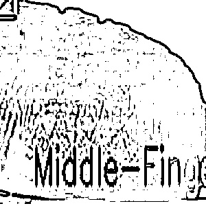
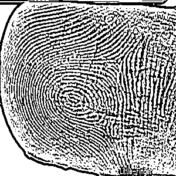

## Installation

To run this project, install the required dependencies:

```bash
pip install "ultralytics<=8.3.40" supervision roboflow opencv-python
```

## Dataset Preparation

Download the dataset using **Roboflow**:

```python
from roboflow import Roboflow
rf = Roboflow(api_key="YOUR_API_KEY")
project = rf.workspace("adpm").project("finger-tips-detection")
version = project.version(1)
dataset = version.download("yolov11")
```

## Training the Model

Train **YOLO v11** for fingertip detection:

```python
from ultralytics import YOLO
model = YOLO('yolo11s-seg.pt')

train_results = model.train(
    data='path/to/data.yaml',
    epochs=30,
    imgsz=640,
    device=0,
)
```

## Model Evaluation

Evaluate the trained model on validation data:

```python
metrics = model.val(data="path/to/data.yaml")
print(metrics)
```

## Results

- Successfully trained **YOLO v11** to detect fingertips with high accuracy.
- Extracted and enhanced **fingerprint images** using **OpenCV**.
- Achieved robust performance in **biometric feature extraction**.

## Future Improvements

- Experiment with **alternative YOLO architectures** for improved accuracy.
- Enhance fingerprint feature extraction using **deep learning-based segmentation**.
- Integrate with **biometric authentication systems** for real-world applications.

## Contributors

- **SMH125** - Research & Implementation

## License

This project is open-source and available under the [MIT License](LICENSE).
